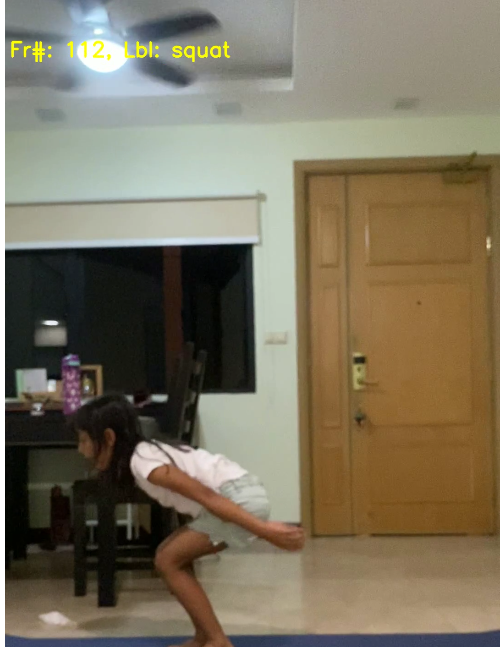
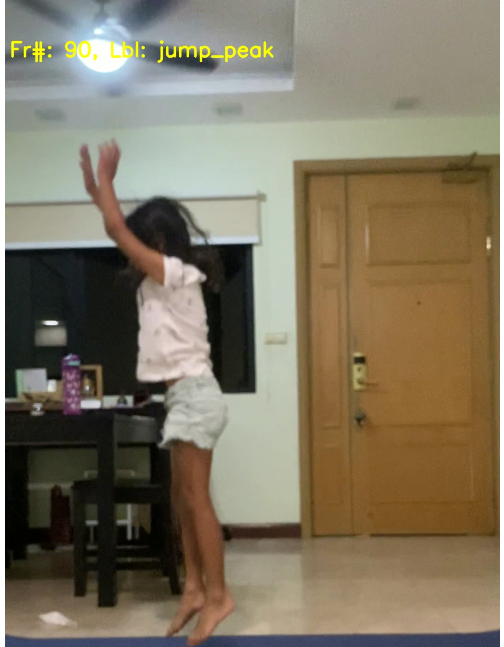

# Objective of the PoC 

This project applies human pose detection and machine learning to help kids practise Fundamental Movement Skills (FMS). FMS is a set of structured movements (like vertical jump). Proficiency in these fundamental movements will help kids improve athletic performance in a wide range of activities. 

In this PoC, we will use machine learning to detect frames with the kid in 2 key states in a vertical jump - squat and jump peak. 

The next step will be to evaluate the kids performance using standard FMS criteria for squat and jump peak. 

## Model Training: 

Trained model using 2000 images of vertical jumps. Images were tagged as squat, jump peak or transition (anything in between). 

## Result: 
Model has 70% accuracy on test set. Some samples below. The mlde detects the squat and jump_peak frame. 





# Running the Pipelines 

This repo has the following key Pipelines: 

- pipeline_critical_pose.py
- pipeline_human_pose_points.py
- pipeline-vjump-report.py

## pipeline_critical_pose.py

### EC2 Setup

Virtual Machine Hardware Specifications
1 Ubuntu 18.04 
2 HDD 20 GB 

### Software Install Guide

Once in the AWS virtual machine, do the following steps

#### Install Conda 
```
* wget https://repo.anaconda.com/miniconda/Miniconda3-latest-Linux-x86_64.sh
* chmod +x Miniconda3-latest-Linux-x86_64.sh
./Miniconda3-latest-Linux-x86_64.sh
* rm ./Miniconda3-latest-Linux-x86_64.sh
```
#### Create and activate python environment
```
* conda create -n fastai-dev python=3.6
* conda activate fastai-dev
```

#### Install packages:

cv2, scipy, boto3,shutil, pandas
pip install <<package_name>

#### Git clone the w_yrs_poc1 repo 

### AWS Configuration

```
aws configure
```

### Running the Code 

``` 
python3 pipeline_critical_pose.py --file=<<filename_in_s3_bkt_w-yrs-input-video>> --rotate <<angle>> -o -d
```
